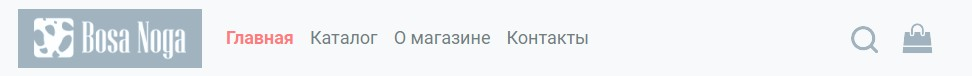
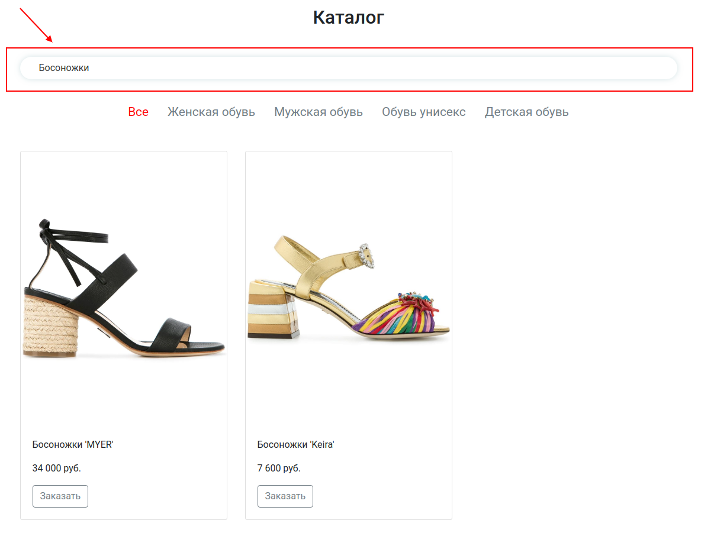

# Интернет магазин обуви

Дипломный проект курса [React для JS-разработчиков](https://netology.ru/programs/react)

## **Задача проекта**

Дипломный проект представляет собой интернет-магазин обуви. Задача заключается в создании работающего приложения, всеми основными функциями которого можно пользоваться.

Бэкенд проекта находится по [ссылке](https://github.com/alekseeva-t-v/ra16-diploma-backend). Проект работает после запуска бэкенда.

## **Содержание**

Приложение содержит следующие самостоятельные экраны (страницы):

* Главная страница.
* Каталог товаров.
* Информационная страница.
* Страница товара.
* Корзина.
* 404

## **Переходы между экранами**

Навигационным центром приложения являются шапка и футер каждого экрана (страницы):

Из шапки можно попасть на следующие экраны:

* ***логотип*** и ***ссылка «Главная»*** — ведут на главную страницу, URL — "/";
* ***«Kаталог»*** — ведёт на страницу каталога, URL — "/catalog.html";
* ***«О магазине»*** — ведёт на страницу «О магазине», URL — "/about.html";
* ***«Контакты»*** — ведёт на страницу «Контакты», URL — "/contacts.html".

Из футера можно попасть на следующие экраны:

* ***«О магазине»*** — ведёт на страницу «О магазине», URL — "/about.html";
* ***«Kаталог»*** — ведёт на страницу каталога, URL — "/catalog.html";
* ***«Контакты»*** — ведёт на страницу «Контакты», URL — "/contacts.html".

## **Описание экранов**

### **Главная страница**

Экран «Главная страница» доступен по умолчанию при открытии приложения.

После загрузки страница выглядит следующим образом:

### **Каталог товаров**
Экран «Каталог товаров» выглядит следующим образом:

Фактически он полностью повторяет функциональность каталога на главной странице, за одним исключением: у него есть поле поиска.

Если категория меняется, то данные перезагружаются с учётом строки поиска.

Строка поиска реагирует только на полный ввод, не live-поиск.

### **Поиск**
На всех страницах в шапке присутствует виджет поиска:

По умолчанию поисковое поле скрыто, отображается только иконка.
Эта иконка работает следующим образом: при первом клике открывает строку поиска, при втором, если был введён какой-то текст, то перенаправляет пользователя на страницу каталога (/catalog.html), при этом в поисковом поле должен быть отображён тот же текст, что был ввёден в строку поиска в шапке, и загрузка данных должна происходить исходя из этого:

Поиск на сервере работает по точному совпадению цвета без учёта регистра, например, «чёрный», и по содержанию слова для названия без учёта регистра, например, можно найти «жар» в «Туфли Жар-птицы».

Если пользователь не ввёл никакой текст, то строка поиска просто схлопывается обратно, как сейчас реализовано в html.

### **О магазине, контакты**
Это просто контентные страницы, в которые жёстко зашит контент. Никакой логики, кроме работы виджета поиска и ссылок, там нет.

### **Страница товара**
Страница товара выглядит следующим образом:

### **Страница корзины**
В корзину можно попасть, либо заказав что-то, либо кликнув на иконку корзины в шапке сайта.

Корзина выглядит следующим образом:

Блок «Корзина» отображает товары, находящиеся в корзине. Все товары хранятся локально в localStorage. Товар можно удалить из корзины, тогда он удалится и из localStorage тоже.

Одной позицией считается пара — товар + размер. То есть если купить те же босоножки другого размера, то это будет две позиции в корзине. А если два раза купить босоножки того же размера, то изменится количество и общая стоимость, но запись останется в табличке одна.

Общая сумма рассчитывается на базе суммирования всех позиций при отображении.

Соответственно, виджет корзинки отображает количество позиций в корзине:

Если в корзине товаров нет вообще, то розового индикатора с числом тоже нет.

После успешного оформления заказа все данные корзины вычищаются из state и из localStorage.

Пользователю отображается loader и сообщение об успехе.

### **404**
При вводе несуществующего URL, не соответствующего ни одному из путей, пользователю показывается страница 404.html.

## **Реализация проекта**
- Реализован постраничный роутинг для удобной навигации по различным страницам магазина.
- Созданы шапка и футер, обеспечивающие единый стиль и навигацию по сайту.
- Разработаны статичные страницы, такие как страница 404 (ошибка), страница "О магазине" и страница "Контакты".
- Добавлен баннер для привлечения внимания пользователей.
- Реализована работа с HTTP-запросами.
- Создан компонент "Хиты продаж", отображающий популярные товары магазина.
- Разработан компонент каталога, который отображается как на главной странице, так и на странице каталога.
- Добавлена функция поиска товаров для удобного поиска конкретных продуктов.
- Подключен Redux для управления состоянием приложения.
- Реализовано глобальное состояние, включающее состояние корзины покупок.
- Созданы компоненты корзины и оформления заказа, позволяющие пользователям добавлять товары в корзину и оформлять заказы.
- Добавлены загрузчик и обработка ошибок для улучшения пользовательского опыта при загрузке данных.

В результате выполнения данных задач был создан полноценный интернет-магазин на React, обладающий удобной навигацией, функциональностью поиска, возможностью добавления товаров в корзину и оформления заказов, а также обеспечивающий удобную работу с HTTP-запросами и обработку ошибок.

## **Стек технологий**

## [**Демо**](https://ra16-diploma.vercel.app/)
